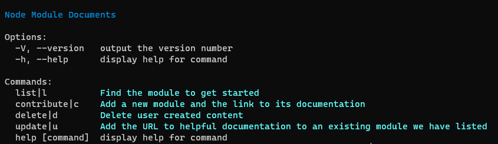
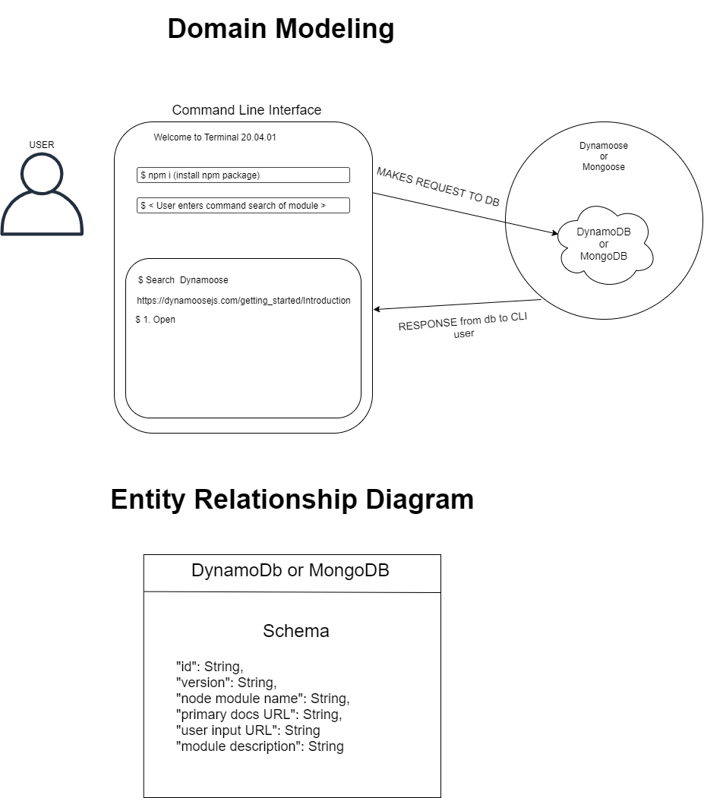

# Project: Mod-s

### (Module Documentation Support)

## Authors: Ricardo Barcenas, Mariko Alvarado, Stacy Burris, Simon Panek

### Contributors and Collaborators

- Many thanks to Lena, Adam, and Brai for assistance with the development of our application.
- Many additional thanks to the future contributors who will build upon and maintain the content of our database!

## Description 

- A Command Line Interface that allows the user to request the docs for an assortment of Node Modules. The CLI will open the users default browser and display the requested documentation.

### Resources

- [inquirer](https://medium.com/jspoint/making-cli-app-with-ease-using-commander-js-and-inquirer-js-f3bbd52977ac)
- [Build a CLI Application Video](https://www.youtube.com/watch?v=v2GKt39-LPA)
- [CI/CD on GitLab](https://gitlab.com/mod-s/module-docs-support/-/pipelines)
- [Trello](https://trello.com/b/MYPIAEBG/mod-s)

## [Software Requirements](requirements.md)

## Routes

- GET All - https://module-support.herokuapp.com/mods
  - Requires: None
- GET 1 - https://module-support.herokuapp.com/mods/{id}
  - Requirements: Must send the record ID as a parameter
- POST - https://module-support.herokuapp.com/mods
  - Requirements: Must send the following on the body `{"name": "module name", "mainUrl": "http://www.example.com", "multiUrl": ["http://www.exampleTwo.com"], "description": "informative description here", "protect": false}`
- PUT - https://module-support.herokuapp.com/mods/{id}
  - Requirements: Must send the record ID as a parameter as well as the following on the body `{"updateUrl": "http://www.exampl3.com"}`
- DELETE - https://module-support.herokuapp.com/mods/{id}
  - Requirements: Must send the record ID as a parameter as well as the following on the body `{"deleteRecord": <1 or 0>, "urlToDelete": <index position of desired URL>"}`

## CLI Commands

| **Command** | **Description** |
| --- | --- |
| `mod-support` | Access the CLI overview |
| `mod-support list` | Lists all modules currently in the database |
| `mod-support l` | Shorthand command for list |
| `mod-support contribute` | Allows the user to contribute a new module to the database |
| `mod-support c` | Shorthand command for contribute |
| `mod-support update` | Allows the user to add an additional document URL to an existing module |
| `mod-support u` | Shorthand command for update |
| `mod-support delete` | Allows the user to delete community generated content |
| `mod-support d` | Shorthand command for delete |
| `-h` | Added to any other command will provide help for the chosen command |

## NPM Package and Install Info

- Command Line Installation
  - Run the following command in the terminal: $`npm install -g mod-support`
    - `-g` Flag is used to install globally which will give access from any terminal location.

### Domain Modeling and Entity Relationship

